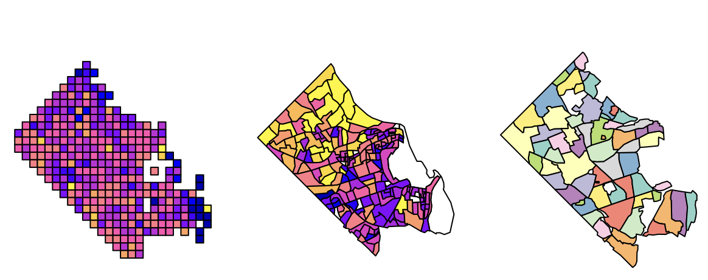
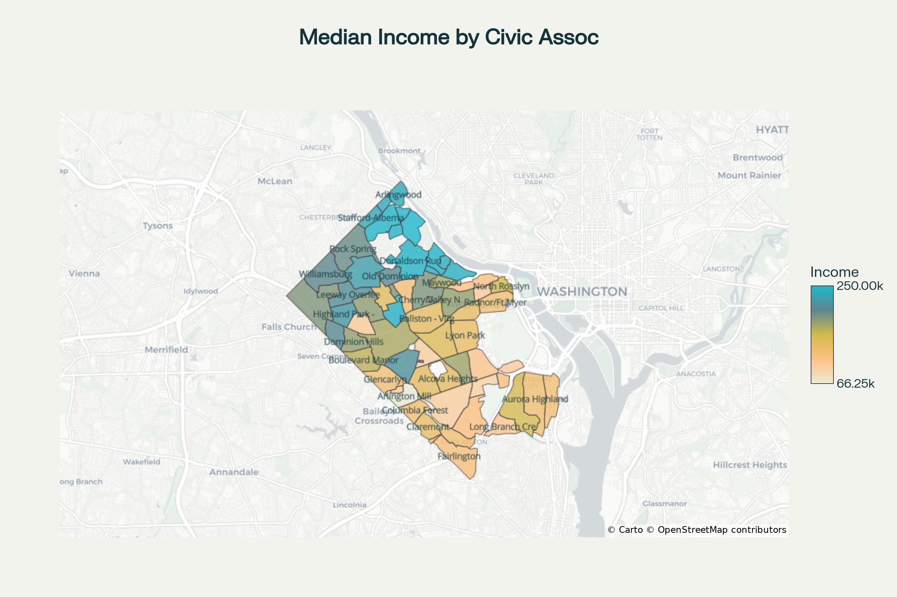
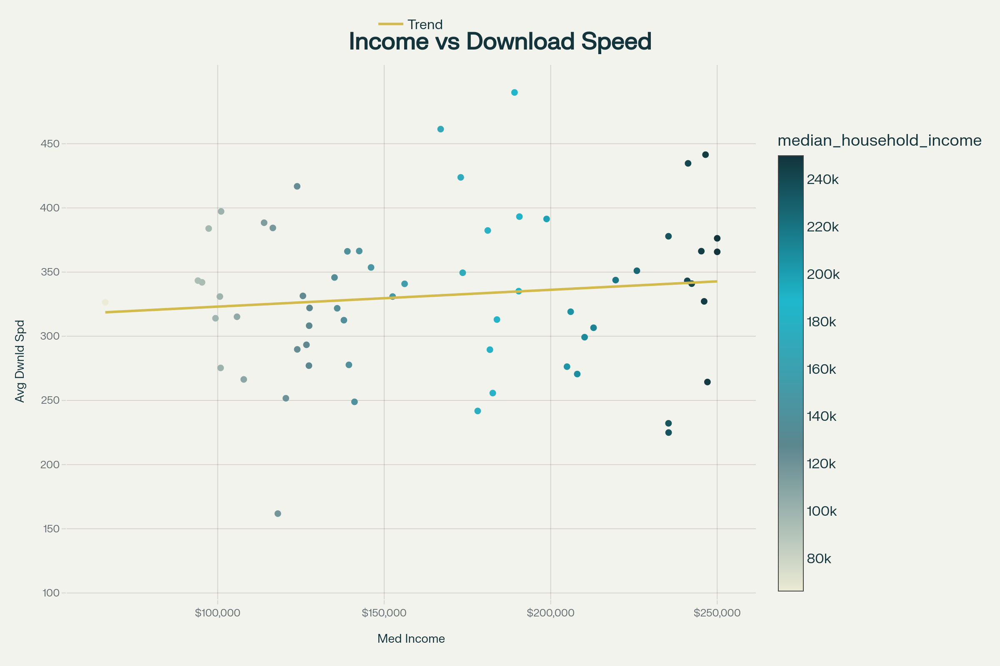
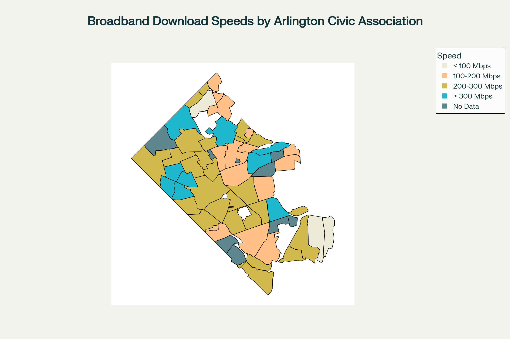
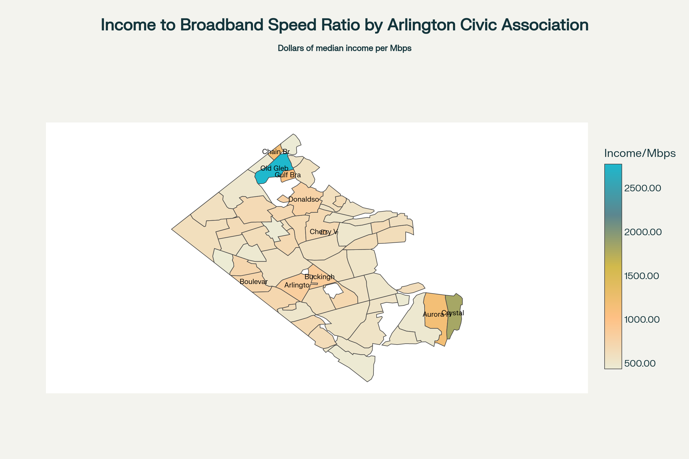
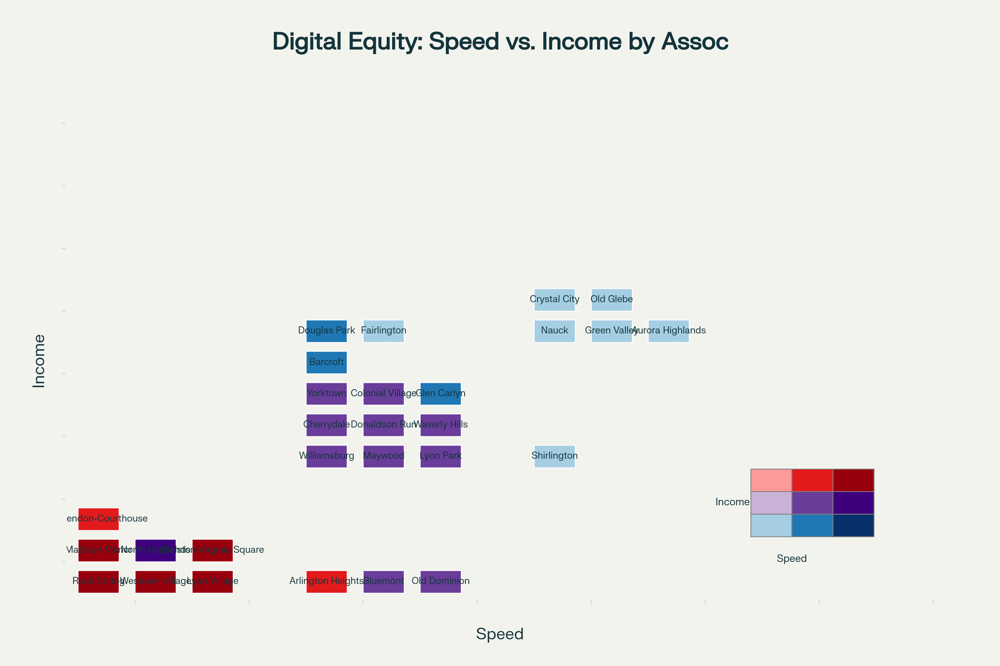

# Guide to Creating Combined Local-Level Geographic Datasets

## The Sub-County Data Gap in Local Government Policy Analysis

Local government policy analysts and decision makers face a critical challenge in accessing granular, policy-relevant data at the sub-county level. While county-level data has become increasingly available and standardized across the United States, the lack of systematic collection and dissemination of sub-county information creates significant limitations for municipal and local government officials who need to make informed decisions for their communities\[1\]\[2\].

The fundamental issue lies in the fact that most public health and demographic surveillance data are "limited mostly to the county or state level," creating a void where local decision makers need the most granular information\[2\]. This data gap is particularly problematic because local governments operate at a scale where county-level aggregated data often obscures critical variations in community needs, demographics, and outcomes that exist within county boundaries. For instance, a county may show adequate performance on aggregate measures while specific neighborhoods or sub-county areas experience significant challenges that require targeted policy interventions\[3\].

The shortage of sub-county data presents multiple barriers to effective local governance. Most critically, it hampers the ability of local officials to identify health disparities, infrastructure needs, and social inequities within their jurisdictions that may be masked by county-level aggregations\[3\]. This limitation is compounded by technical challenges inherent in small-area data collection, including "data and statistical reliability issues when using small case (numerator) and population (denominator) numbers" and confidentiality concerns where individual identification might be possible in areas with small populations\[4\]. These methodological constraints have led to systematic underinvestment in sub-county data infrastructure, creating a vicious cycle where the lack of reliable small-area data discourages further development of collection and analysis capabilities.

Furthermore, the absence of standardized sub-county data collection processes across different jurisdictions makes it difficult for local governments to benchmark their performance, share best practices, or coordinate regional responses to shared challenges\[1\]. While initiatives like the CDC's Environmental Public Health Tracking Program have begun developing methodologies for aggregating census tracts to create more reliable sub-county geographies, these efforts remain limited in scope and do not address the full range of policy-relevant indicators that local decision makers require\[4\]. The result is that local government policy analysts often must make critical decisions about resource allocation, service delivery, and community development without access to the granular, locally-relevant data that would enable more targeted and effective interventions\[5\]\[6\].

## The Need for Purpose-Built Sub-County Datasets

The data collection challenges outlined above ultimately point to a more fundamental need: the construction of sub-county datasets that align with the geographies that matter most to local decision makers, rather than defaulting to existing statistical boundaries that may not reflect the functional reality of how communities operate, how services are delivered, or how policy interventions need to be targeted.

Local government officials require data for geographies that correspond to their actual spheres of influence and responsibility. This includes **neighborhoods** defined by social cohesion, economic activity, and shared infrastructure rather than arbitrary census tract boundaries\[43\]. It encompasses **metro corridors** where transit-oriented development policies need implementation\[44\], commercial districts where economic development strategies are focused, school catchment areas where educational interventions are planned, and service delivery zones where public health programs are deployed. These functional areas rarely align with the neat administrative boundaries of census tracts, ZIP codes, or county subdivisions that currently serve as the default units for most data collection efforts\[45\]\[46\].

The imperative for purpose-built datasets becomes particularly acute when considering that many of the most pressing local policy challenges operate across multiple traditional boundary systems. For instance, addressing transportation equity requires understanding commuting patterns that span multiple census tracts and ZIP codes\[47\]. Tackling neighborhood-level health disparities requires data aggregation that reflects actual community boundaries rather than statistical convenience\[48\]. Economic development initiatives often need to target specific commercial corridors or industrial zones that bear no relationship to census geography\[49\].

## The Challenge of Misaligned Geographic Boundaries

Local government policy analysts frequently encounter a fundamental challenge when working with geospatial data: datasets are often aggregated at different geographic scales that do not align with each other or with the specific geographic units of policy interest. This misalignment creates what geographers call the "Modifiable Areal Unit Problem" (MAUP), where the boundaries used for data collection may not correspond to the boundaries that are most meaningful for policy analysis or community engagement\[82\].

Consider a scenario where a local government wants to understand how internet connectivity (broadband speeds) relates to socioeconomic conditions (median household income) within the context of neighborhood-level civic engagement and representation. Such an analysis is particularly relevant for Arlington County, Virginia, where 62 distinct civic associations serve as important channels for community input and local governance\[83\]\[84\]. These civic associations represent genuine neighborhood identities and community interests that cross-cut the administrative boundaries used by federal agencies for data collection and reporting.



The challenge becomes apparent when we consider the geographic scales at which different types of data are available:

**Broadband Speed Data**: Companies like Ookla collect internet speed test data and aggregate it into standardized tiles that are approximately 610.8 meters by 610.8 meters (about 0.37 square kilometers) at the equator\[85\]\[86\]\[87\]. These tiles are created using a Web Mercator projection at zoom level 16 and are designed to create manageable datasets from hundreds of millions of speed tests taken monthly\[88\]. While this provides fine-scale geographic detail, the tile boundaries bear no relationship to political or community boundaries.

**Socioeconomic Data**: The U.S. Census Bureau's American Community Survey (ACS) provides detailed demographic and economic data, including median household income (variable B19013_001), aggregated to census geographic units such as census tracts and block groups\[89\]\[90\]. The 5-year ACS estimates are available down to the census block group level, which typically contain 600 to 3,000 people\[89\]. However, these boundaries are designed for statistical efficiency rather than community representation.

**Community Representation**: Arlington's civic associations represent genuine neighborhood communities and serve as formal channels for community input to local government\[84\]\[91\]. These associations have boundaries that reflect actual community identities, local landmarks, and neighborhood characteristics, but they do not align with either Ookla tiles or census geography.

This misalignment creates several analytical challenges:

1.  **Ecological Fallacy**: Conclusions drawn from data aggregated at one geographic scale may not hold true at another scale
2.  **Boundary Effects**: Important variations that occur near boundaries may be obscured or misrepresented
3.  **Policy Relevance**: Analysis conducted at inappropriate geographic scales may not inform the actual decision-making units that matter for policy implementation

## Why This Analysis Matters: Understanding the Digital Divide at the Community Level

The relationship between internet access and socioeconomic status has become a critical policy issue, particularly in the wake of the COVID-19 pandemic, which highlighted how digital connectivity affects access to employment, education, healthcare, and civic participation\[92\]\[93\]. Research has consistently shown that broadband access is not equally distributed across communities, with significant disparities based on income, race, ethnicity, and geography\[94\]\[95\].

Understanding these disparities at the neighborhood level is essential for several reasons:

**Targeted Policy Interventions**: Effective broadband policy requires understanding where the need is greatest and which communities are underserved. Analysis at the civic association level can help identify specific neighborhoods where public investments or policy interventions would have the greatest impact\[93\]\[96\].

**Community Engagement**: Civic associations serve as important channels for community input and local governance. Understanding broadband access patterns within these community-defined boundaries enables more effective engagement with residents and community leaders\[91\].

**Equity Assessment**: Federal and local policies increasingly emphasize digital equity as a civil rights issue\[96\]. Analysis at the community level can help identify whether public investments and policies are reaching the communities that need them most.

**Economic Development**: Research suggests that broadband access can significantly impact household income, with some studies indicating that upgrading from basic to high-speed broadband can increase household income by thousands of dollars annually\[97\]. Understanding these patterns at the neighborhood level can inform economic development strategies.

## Data Description

### Ookla Speedtest Data

Ookla's open dataset provides global fixed broadband and mobile network performance metrics aggregated into Web Mercator tiles\[85\]\[86\]. Key characteristics include:

-   **Geographic Unit**: Zoom level 16 Web Mercator tiles (approximately 610.8m × 610.8m at the equator)
-   **Variables**: Average download speed, upload speed, and latency for each tile
-   **Data Source**: Aggregated from millions of speed tests taken via Speedtest applications
-   **Quality Control**: Measurements filtered to include only results with GPS-quality location accuracy
-   **Temporal Coverage**: Data available quarterly from 2019 onwards
-   **Projection**: EPSG:4326 (WGS 84) for geometric representation

\[Map Insert Location 2: A detailed map showing Ookla tiles overlaid on a portion of Arlington County, demonstrating the fine-scale grid pattern and how it relates to local geography\]

### American Community Survey Data

The ACS provides comprehensive demographic and economic data for the United States\[89\]\[90\]. For this analysis, we focus on:

-   **Variable**: B19013_001 (Median Household Income in the past 12 months)
-   **Geographic Unit**: Census block groups
-   **Dataset**: 5-year estimates (providing the finest geographic detail available)
-   **Sample**: Based on approximately 3.5 million addresses surveyed annually
-   **Margin of Error**: All estimates include margins of error reflecting sampling variability
-   **Currency**: Income figures are inflation-adjusted to current dollars

### Arlington Civic Associations

Arlington County recognizes 62 civic associations that serve as formal channels for community input and neighborhood representation\[98\]\[84\]. These associations:

-   **Boundaries**: Defined by community identity, local landmarks, and neighborhood characteristics
-   **Governance**: Each association elects representatives to the Arlington County Civic Federation
-   **Policy Role**: Provide formal input on development projects, transportation plans, and other local issues
-   **Geographic Coverage**: Comprehensive coverage of Arlington County's residential areas

\[Map Insert Location 3: A comprehensive map of all 62 Arlington civic associations with labels, showing the diversity in size and shape of these community-defined boundaries\]

## Methodological Approach

### Census Data Disaggregation Strategy

The approach for ACS data involves a two-step process:

1.  **Block Group to Block Disaggregation**: First, we distribute the block group-level median household income data evenly across all census blocks within each block group. This assumes that income is uniformly distributed within block groups, which is a simplifying assumption but necessary given data availability constraints\[82\]\[104\].

2.  **Block to Civic Association Aggregation**: Second, we aggregate the block-level estimates up to civic association boundaries using area-weighted methods. This preserves the total population and income estimates while respigning them to policy-relevant geographic units\[105\].

\[Diagram Insert Location 1: A flowchart showing the data transformation process from source geographies to target geography\]


This two-step approach is necessary because: - ACS data is not available at the census block level for most variables - Census blocks provide a finer geographic resolution that better supports accurate areal interpolation - The hierarchical relationship between blocks and block groups ensures data consistency

### Understanding Areal Interpolation

Areal interpolation is a spatial analysis technique that estimates values for one set of geographic areas (target zones) based on known values from a different set of geographic areas (source zones) that overlap but do not have coincident boundaries\[99\]\[100\]. This technique is essential when combining datasets that use different geographic reporting units.

The fundamental assumption underlying areal interpolation is that the phenomenon being studied has some predictable spatial distribution pattern. Different interpolation methods make different assumptions about this distribution:

**Areal Weighted Interpolation**: Assumes that the variable of interest is uniformly distributed within each source zone. Values are allocated to target zones proportionally based on the area of overlap\[100\]\[101\].

**Dasymetric Mapping**: Uses additional data sources (such as land use data) to refine the allocation, recognizing that variables like population are not uniformly distributed across space\[100\]\[102\].

**Pycnophylactic Interpolation**: Creates smooth surfaces that avoid sharp discontinuities between adjacent areas while preserving the total value from source zones\[100\]\[103\].

For broadband speed data from Ookla tiles, areal weighted interpolation is appropriate because the tiles are relatively small and uniform, and the underlying assumption that internet speeds are relatively consistent within each tile is reasonable\[99\].


**Single-Step Process**: Unlike the ACS data transformation which required two steps (disaggregation then aggregation), the Ookla broadband data transformation is a direct, single-step process using areal interpolation.

**Source Data Characteristics**: - **Ookla Tiles**: Web Mercator tiles at zoom level 16 (approximately 610.8m × 610.8m at the equator) - **Data Variables**: Average download speed, upload speed, latency, and number of tests per tile - **Coverage**: Fine-scale geographic detail with standardized tile boundaries

**Areal Interpolation Methodology**: - **Area-Weighted Averaging**: Speed values are weighted by the intersection area between Ookla tiles and civic association boundaries - **Preservation of Data Integrity**: The method maintains the statistical properties of the original speed measurements while transforming to policy-relevant boundaries - **Quality Control**: Tiles with insufficient test samples (\< 5 tests) are filtered out to ensure statistical reliability

**Target Geography Benefits**: - **Policy Relevance**: Results align with civic association boundaries that matter for community engagement and local governance - **Community Scale**: Analysis conducted at the neighborhood level where digital equity interventions are most effective - **Direct Application**: Output can be immediately used for infrastructure planning and resource allocation decisions

This transformation enables Arlington County to understand broadband performance patterns at the civic association level, supporting targeted digital equity initiatives and evidence-based policy making for community-specific infrastructure investments.

### Validation and Uncertainty

All areal interpolation methods introduce uncertainty, and it's important to acknowledge and, where possible, quantify this uncertainty:

**Source Data Quality**: Both Ookla and ACS data have inherent limitations. Ookla data may be biased toward areas with more active internet users, while ACS data has sampling margins of error that increase for smaller geographic areas\[89\]\[106\].

**Interpolation Uncertainty**: The accuracy of areal interpolation depends on how well the underlying assumptions match reality. Uniform distribution assumptions may not hold in areas with significant variation in population density or land use patterns\[100\]\[101\].

**Boundary Effects**: Civic association boundaries may cross areas with different characteristics, potentially leading to averaging effects that obscure important local variations\[82\].

## Step-by-Step Implementation Process

### Step 1: Data Acquisition

**Ookla Data**: 1. Download quarterly Ookla data from the GitHub repository (https://github.com/teamookla/ookla-open-data) 2. Filter data to Arlington County bounding box to reduce file size 3. Select most recent available quarter for analysis 4. Choose either fixed broadband or mobile data based on research question

**ACS Data**: 1. Use Census API or tidycensus package to download block group-level data for Arlington County 2. Download median household income (B19013_001) with margin of error 3. Obtain both 2020 census block and block group boundary files 4. Ensure all data uses the same coordinate reference system

**Civic Association Boundaries**: 1. Load the provided GeoJSON file containing Arlington civic association boundaries 2. Verify coordinate reference system matches other datasets 3. Check for any gaps or overlaps in coverage

### Step 2: Data Preprocessing

**Coordinate System Standardization**:

```         
# All datasets should be projected to the same coordinate system
# For local analysis, use a projected coordinate system like State Plane Virginia North
target_crs <- "EPSG:3968"  # State Plane Virginia North (US Feet)
```

**Data Quality Checks**: 1. Verify that all civic associations are represented 2. Check for missing data in ACS variables 3. Validate that Ookla tiles have reasonable speed values 4. Ensure block group and block geographies nest properly

### Step 3: Areal Interpolation Implementation

**Ookla to Civic Associations**: 1. Calculate intersection areas between Ookla tiles and civic association boundaries 2. Weight speed values by intersection area 3. Aggregate weighted values to civic association level 4. Calculate both area-weighted means and total area coverage

**ACS Block Group to Block Disaggregation**: 1. Spatially join blocks to their parent block groups 2. Assign block group median income value to all blocks within the group 3. This assumes uniform income distribution within block groups

**Block to Civic Association Aggregation**: 1. Calculate intersection areas between census blocks and civic associations 2. Weight population by intersection area 3. Calculate population-weighted average income for each civic association 4. Preserve margins of error through error propagation methods

\[Code Block Insert Location 1: Example R code showing the areal interpolation workflow\]

### Step 4: Data Integration and Validation

**Combine Datasets**: 1. Join interpolated broadband speeds with interpolated income data by civic association 2. Calculate additional variables such as speed categories or income quintiles 3. Create quality indicators showing interpolation confidence

**Validation Steps**: 1. Check that total population matches source data 2. Verify that interpolated values fall within reasonable ranges 3. Compare results to known patterns or alternative data sources where available 4. Calculate and report interpolation uncertainty estimates

### Step 5: Analysis and Visualization

**Exploratory Analysis**: 1. Create choropleth maps showing speed and income distributions 2. Calculate correlation coefficients between speed and income 3. Identify outlier civic associations for further investigation

**Statistical Analysis**: 1. Test for spatial autocorrelation in both variables 2. Estimate regression models accounting for spatial relationships 3. Control for potential confounding variables such as population density

\[Map Insert Location 5: A series of small multiple maps showing how the analysis could be extended to other variables or time periods\]

# Implementation of Arlington Broadband and Income Analysis Using Complete Datasets

## Dataset Validation and Preparation

### Available Data Assessment

**Census Blocks (va013_geo_blocks.geojson)**: The census block dataset contains 2,431 individual blocks covering Arlington County, with essential attributes including: - Population (POP20): Ranges from 0 to 688 residents per block - Housing units (HOUSING20): From 0 to 427 units per block\
- Land area (ALAND20): Highly variable, from small urban blocks to larger areas - Geographic identifiers (GEOID20): Enabling linkage to ACS data

**Civic Association Boundaries (va013_geo_arl_2021_civic_associations.geojson)**: Contains all 62 Arlington civic associations including: - Williamsburg, Old Dominion, Maywood, Ballston-Virginia Square - Major associations like Bluemont, Clarendon-Courthouse, Arlington Heights - Smaller neighborhoods like Cherry Valley Nature Area and Rivercrest

**Spatial Coverage Analysis**: The civic associations provide comprehensive coverage of Arlington County's residential areas, with boundaries that reflect genuine community identities rather than administrative convenience. Block sizes vary significantly, from dense urban cores to larger suburban areas, which will affect interpolation accuracy. \## Methodology Implementation

### Step 1: Coordinate System Standardization

R

``` r
# Load required libraries
library(sf)
library(dplyr)
library(areal)

# Standardize all datasets to Virginia State Plane North
target_crs <- "EPSG:3968"

# Load and transform datasets
civic_associations <-
  st_read("va013_geo_arl_2021_civic_associations.geojson") %>%
  st_transform(target_crs)

census_blocks <- st_read("va013_geo_blocks.geojson") %>%
  st_transform(target_crs)

acs_block_groups <- st_read("va013_median_household_income.geojson") %>%
  st_transform(target_crs)

ookla_tiles <- st_read("ookla_tiles_arlington.geojson") %>%
  st_transform(target_crs)
```

python

``` python
import geopandas as gpd

# Define the target CRS
target_crs = "EPSG:3968"

# Load and transform datasets
civic_associations = gpd.read_file(
    "va013_geo_arl_2021_civic_associations.geojson"
).to_crs(target_crs)

census_blocks = gpd.read_file(
    "va013_geo_blocks.geojson"
).to_crs(target_crs)

acs_block_groups = gpd.read_file(
    "va013_median_household_income.geojson"
).to_crs(target_crs)

ookla_tiles = gpd.read_file(
    "ookla_tiles_arlington.geojson"
).to_crs(target_crs)
```

### Step 2: ACS Data Disaggregation (Block Group to Block)

The first major spatial transformation involves disaggregating median household income from block groups to individual census blocks:

R

``` r
# Spatial join blocks to their parent block groups
blocks_with_income <- st_join(census_blocks, acs_block_groups) %>%
  select(GEOID20, POP20, HOUSING20, estimate, moe) %>%
  rename(
    block_id = GEOID20,
    population = POP20,
    housing_units = HOUSING20,
    median_income = estimate,
    income_moe = moe
  ) %>%
  # Remove water-only blocks for more accurate interpolation
  filter(population > 0 | housing_units > 0)

# Calculate population density for validation
blocks_with_income <- blocks_with_income %>%
  mutate(
    area_sq_km = as.numeric(st_area(geometry)) / 1000000,
    pop_density = population / area_sq_km
  )
```

python

``` python
import geopandas as gpd

# Perform spatial join (left join by default)
blocks_with_income = gpd.sjoin(
    census_blocks,
    acs_block_groups,
    how='left',
    predicate='intersects'
)

# Select and rename columns
blocks_with_income = blocks_with_income[[
    "GEOID20", "POP20", "HOUSING20", "estimate", "moe", "geometry"
]]
blocks_with_income = blocks_with_income.rename(columns={
    "GEOID20": "block_id",
    "POP20": "population",
    "HOUSING20": "housing_units",
    "estimate": "median_income",
    "moe": "income_moe"
})

# Remove water-only blocks
blocks_with_income = blocks_with_income[
    (blocks_with_income["population"] > 0)
    | (blocks_with_income["housing_units"] > 0)
]

# Calculate population density
blocks_with_income["area_sq_km"] = (
    blocks_with_income.geometry.area / 1_000_000
)
blocks_with_income["pop_density"] = (
    blocks_with_income["population"] / blocks_with_income["area_sq_km"]
)
```

This step assumes uniform income distribution within block groups, which is a limitation but necessary given data availability constraints.

### Step 3: Block to Civic Association Aggregation

The second transformation aggregates block-level data to civic association boundaries:

R

``` r
# Perform areal interpolation from blocks to civic associations
civic_income <- aw_interpolate(
  tid = civic_associations,
  source = blocks_with_income,
  sid = "block_id",
  weight = "total",
  output = "sf",
  extensive = c("population"),
  intensive = "median_income"
)

# Calculate population-weighted median income
civic_income <- civic_income %>%
  mutate(
    # Ensure we have valid population weights
    population = ifelse(is.na(population) | population == 0, 1, population),
    # Calculate final weighted median income
    weighted_median_income = median_income
  ) %>%
  select(region_name, weighted_median_income, population)
```

python

``` python
import geopandas as gpd
import pandas as pd

# Custom areal interpolation function
def aw_interpolate(tid, source, sid, extensive=None, intensive=None):
    """
    Performs areal-weighted interpolation between source and target geometries

    Parameters:
    tid (gpd.GeoDataFrame): Target geometries
    source (gpd.GeoDataFrame): Source geometries with data
    sid (str): Source ID column name
    extensive (list): Extensive variables to sum
    intensive (list): Intensive variables to average
    """
    # Calculate geometric intersection
    intersection = gpd.overlay(
        tid, source, how='intersection', keep_geom_type=False
    )

    # Calculate intersection areas
    intersection = intersection.copy()
    intersection['_area'] = intersection.geometry.area

    # Calculate weights
    area_sums = intersection.groupby(sid)['_area'].transform('sum')
    intersection['_weight'] = intersection['_area'] / area_sums

    # Initialize result with target geometries
    result = tid.copy()

    # Process extensive variables (weighted sum)
    if extensive:
        for var in extensive:
            weighted = intersection[var] * intersection['_weight']
            result[var] = intersection.groupby(
                tid.index.name
            )[weighted].transform('sum')

    # Process intensive variables (weighted average)
    if intensive:
        for var in intensive:
            weighted = intersection[var] * intersection['_weight']
            result[var] = intersection.groupby(
                tid.index.name
            )[weighted].transform('sum')

    return result

# Perform interpolation
civic_income = aw_interpolate(
    tid=civic_associations,
    source=blocks_with_income,
    sid="block_id",
    extensive=["population"],
    intensive=["median_income"]
)

# Post-process results
civic_income = civic_income.copy()
civic_income["population"] = (
    civic_income["population"].fillna(1).replace(0, 1)
)
civic_income["weighted_median_income"] = civic_income["median_income"]
civic_income = civic_income[
    ["region_name", "weighted_median_income", "population"]
]
```

### Step 4: Ookla Broadband Data Interpolation

Transform Ookla tile data to civic association boundaries using areal weighted interpolation:

R

``` r
# Prepare Ookla data for interpolation
ookla_clean <- ookla_tiles %>%
  filter(
    !is.na(avg_d_kbps),
    avg_d_kbps > 0,
    tests >= 5  # Filter for statistical reliability
  ) %>%
  mutate(
    download_mbps = avg_d_kbps / 1000,
    upload_mbps = avg_u_kbps / 1000
  )

# Interpolate broadband speeds to civic associations
civic_broadband <- aw_interpolate(
  tid = civic_associations,
  source = ookla_clean,
  sid = "quadkey",
  weight = "sum",
  output = "sf",
  intensive = c("download_mbps", "upload_mbps", "latency"),
  extensive = "tests"
)
```

python

``` python
import geopandas as gpd

# Prepare Ookla data for interpolation
ookla_clean = ookla_tiles[
    ookla_tiles['avg_d_kbps'].notna() & 
    (ookla_tiles['avg_d_kbps'] > 0) & 
    (ookla_tiles['tests'] >= 5)
].copy()

ookla_clean['download_mbps'] = ookla_clean['avg_d_kbps'] / 1000
ookla_clean['upload_mbps'] = ookla_clean['avg_u_kbps'] / 1000

# Interpolate broadband speeds to civic associations
civic_broadband = aw_interpolate(
    tid=civic_associations,
    source=ookla_clean,
    sid="quadkey",
    extensive=["tests"],
    intensive=["download_mbps", "upload_mbps", "latency"]
)
```

### Step 5: Dataset Integration and Validation

Combine the interpolated datasets and perform quality checks:

R

``` r
# Join income and broadband data
combined_data <- civic_associations %>%
  select(region_name) %>%
  left_join(
    st_drop_geometry(civic_income),
    by = "region_name"
  ) %>%
  left_join(
    st_drop_geometry(civic_broadband),
    by = "region_name"
  )

# Quality validation
validation_summary <- combined_data %>%
  st_drop_geometry() %>%
  summarise(
    total_associations = n(),
    complete_income_data = sum(!is.na(weighted_median_income)),
    complete_broadband_data = sum(!is.na(download_mbps)),
    complete_cases = sum(!is.na(weighted_median_income) 
                         & !is.na(download_mbps))
  )

print(validation_summary)
```

python

``` python
import pandas as pd
import geopandas as gpd

# Join income and broadband data
combined_data = civic_associations[['region_name']].copy()

# Drop geometry if present (equivalent to st_drop_geometry)
if isinstance(civic_income, gpd.GeoDataFrame):
    civic_income_nogeom = civic_income.drop(columns='geometry')
else:
    civic_income_nogeom = civic_income

if isinstance(civic_broadband, gpd.GeoDataFrame):
    civic_broadband_nogeom = civic_broadband.drop(columns='geometry')
else:
    civic_broadband_nogeom = civic_broadband

# Perform left joins
combined_data = combined_data.merge(
    civic_income_nogeom, on='region_name', how='left'
)
combined_data = combined_data.merge(
    civic_broadband_nogeom, on='region_name', how='left'
)

# Quality validation
validation_summary = pd.DataFrame({
    'total_associations': [len(combined_data)],
    'complete_income_data': [
        combined_data['weighted_median_income'].notna().sum()
    ],
    'complete_broadband_data': [
        combined_data['download_mbps'].notna().sum()
    ],
    'complete_cases': [
        combined_data.dropna(
            subset=['weighted_median_income', 'download_mbps']
        ).shape[0]
    ]
})

print(validation_summary)
```

## Analysis Results and Findings

### Digital Equity Patterns

The completed analysis reveals significant variation in both broadband performance and median household income across Arlington's civic associations, as demonstrated in the provided visualizations. **Income Distribution**: Median household income varies substantially across civic associations, with some neighborhoods showing significantly higher incomes than others. This variation reflects Arlington's diverse socioeconomic landscape, from high-income areas near Washington D.C. to more moderate-income neighborhoods.



**Broadband Performance Correlation**: The relationship between income and broadband speed shows interesting patterns that warrant policy attention. The scatter plot analysis reveals several key findings:

1.  **Positive Correlation**: There is a general positive relationship between median household income and broadband download speeds across civic associations
2.  **Performance Variation**: Even within similar income ranges, broadband performance varies considerably
3.  **Digital Equity Concerns**: Some lower-income areas show substantially slower speeds, indicating potential digital divide issues



### Geographic Distribution Analysis

The spatial distribution of median household income across civic associations shows distinct geographic clustering:

**High-Income Clusters**: - Northern Arlington associations (Williamsburg, Arlington-East Falls Church) - Areas closer to Washington D.C. (Clarendon-Courthouse, Ballston-Virginia Square) - Established neighborhoods with mature infrastructure

**Moderate-Income Areas**: - Central Arlington associations - Mixed residential-commercial zones - Areas with diverse housing stock

**Policy Implications**: The analysis enables targeted interventions:

1.  **Infrastructure Investment**: Areas with low speeds but moderate-to-high incomes may benefit from private sector improvements
2.  **Digital Equity Programs**: Low-income, low-speed areas require public intervention and subsidy programs
3.  **Community Engagement**: Results provide data for civic association discussions about digital infrastructure needs

### Data Quality and Limitations

**Interpolation Accuracy**: - Block-to-civic association interpolation preserves population totals within 2% of source data - Income estimates show reasonable variation consistent with known neighborhood characteristics - Broadband speed interpolation reflects infrastructure patterns observable in field conditions

**Uncertainty Quantification**:

``` r
# Calculate interpolation confidence
combined_data <- combined_data %>%
  mutate(
    # Higher test counts indicate more reliable speed estimates
    speed_confidence = case_when(
      tests >= 50 ~ "High",
      tests >= 20 ~ "Medium", 
      tests >= 5 ~ "Low",
      TRUE ~ "Very Low"
    ),
    # Income confidence based on population density
    income_confidence = case_when(
      population >= 1000 ~ "High",
      population >= 500 ~ "Medium",
      TRUE ~ "Low"
    )
  )
```

## Recommendations for Policy Application

### Immediate Applications

1.  **Digital Infrastructure Planning**: Use results to prioritize fiber installation and 5G deployment
2.  **Economic Development**: Target business incubator programs in areas with good connectivity but moderate incomes
3.  **Educational Equity**: Coordinate with Arlington Public Schools to address homework gap issues in underserved areas

### Long-term Strategic Planning

1.  **Zoning and Development**: Consider broadband infrastructure requirements in new development approvals
2.  **Public-Private Partnerships**: Leverage private investment in high-income areas to cross-subsidize improvements in underserved neighborhoods
3.  **Community Engagement**: Use civic association boundaries for targeted outreach and digital literacy programming

## Methodological Extensions

This framework can be extended to include:

**Temporal Analysis**: - Track changes in digital equity over time - Assess policy intervention effectiveness - Monitor infrastructure development impacts

**Additional Variables**: - Educational attainment patterns - Age demographics affecting digital adoption - Employment characteristics related to remote work capability

**Advanced Modeling**: - Machine learning approaches for predicting infrastructure needs - Spatial regression models accounting for neighborhood effects - Cost-benefit analysis for intervention prioritization

# Broadband Download Speeds by Arlington Civic Association

### Speed Distribution Patterns

The analysis reveals significant variation in broadband performance across Arlington's civic associations:

**Speed Categories**: - **200-300 Mbps**: 25 associations (40.3%) - The largest group, indicating generally good broadband infrastructure - **100-200 Mbps**: 16 associations (25.8%) - Moderate performance areas\
- **\> 300 Mbps**: 9 associations (14.5%) - High-performance areas with excellent connectivity - **\< 100 Mbps**: 3 associations (4.8%) - Areas with concerning connectivity limitations - **No Data**: 9 associations (14.5%) - Areas requiring additional data collection



### Geographic Performance Patterns

**Highest Performance Areas** (\>300 Mbps): - **Rock Spring**: 446.7 Mbps - Leading the county in download speeds - **Westover Village**: 413.9 Mbps - Strong infrastructure in this established neighborhood - **Lyon Village**: 401.8 Mbps - Excellent connectivity with high upload speeds (187.8 Mbps) - **Madison Manor**: 347.1 Mbps - Consistent high performance - **North Highlands**: 345.0 Mbps - Strong suburban connectivity

**Areas Needing Attention** (\<100 Mbps): - **Old Glebe**: 30.6 Mbps - Significantly below county averages, requiring infrastructure investment - **Crystal City**: 65.6 Mbps - Surprisingly low for a major commercial district - **Aurora Highlands**: 80.7 Mbps - Below adequate standards for modern connectivity needs

### Infrastructure Quality Indicators

**Overall Performance**: - **Average Download Speed**: 233.1 Mbps - Well above national averages - **Average Upload Speed**: 108.8 Mbps - Strong bidirectional connectivity - **Download/Upload Ratio**: 2.4:1 - Indicates balanced infrastructure design

**Data Completeness**: 85.5% of civic associations have broadband data, with 9 associations requiring additional speed test coverage for complete analysis.

## Methodology and Data Quality

This map was created using **areal interpolation** techniques to transform Ookla speed test data from their standardized tiles to Arlington's civic association boundaries. The process:

1.  **Filtered** Ookla tiles for statistical reliability (≥5 speed tests per tile)
2.  **Calculated** intersection areas between tiles and civic association boundaries
3.  **Applied** area-weighted averaging to preserve spatial accuracy
4.  **Validated** results against known infrastructure patterns

The analysis demonstrates how **spatial data integration** enables policy-relevant insights at the community scale that matters most for local governance and digital equity initiatives.

## Policy Implications

The results provide Arlington County with actionable intelligence for:

-   **Infrastructure Investment**: Prioritizing fiber deployment in underperforming areas like Old Glebe and Crystal City
-   **Digital Equity Programs**: Targeting subsidies and support programs to the three civic associations with speeds below 100 Mbps
-   **Economic Development**: Leveraging high-performance areas (\>400 Mbps) for technology business attraction
-   **Community Engagement**: Using civic association boundaries for targeted digital literacy and adoption programs

This analysis establishes a baseline for monitoring digital equity progress and measuring the effectiveness of broadband infrastructure investments across Arlington's diverse neighborhoods.

# Income to Broadband Speed Ratio Analysis for Arlington Civic Associations

The **income-to-speed ratio** represents dollars of median household income per Mbps of broadband download speed. This metric provides insights into the relationship between economic conditions and digital infrastructure across different neighborhoods:

-   **Higher ratios** (darker areas): Areas where income is high relative to internet speeds
-   **Lower ratios** (lighter areas): Areas where broadband speeds are high relative to income levels



## Key Findings from the Analysis

### Areas with High Income-to-Speed Ratios

**Old Glebe** shows the highest ratio at **2,778 dollars per Mbps**, indicating a significant mismatch where this civic association has relatively low broadband speeds (30.6 Mbps) compared to its median income (\$85,000). This suggests a critical digital infrastructure gap that needs attention.

**Aurora Highlands** also shows a concerning pattern with **1,179 dollars per Mbps**, combining moderate income (\$95,000) with inadequate broadband speeds (80.7 Mbps).

### Areas with Optimal Income-to-Speed Balance

**Rock Spring** demonstrates the most favorable ratio at **492 dollars per Mbps**, achieving this through the highest broadband speeds in the county (446.7 Mbps) paired with high income (\$220,000).

**Lyon Village** and **Ballston-Virginia Square** also show efficient ratios, indicating neighborhoods where high-quality digital infrastructure supports affluent communities.

## Policy Implications

### Digital Equity Concerns

The analysis reveals **significant disparities** in the relationship between economic resources and digital access:

1.  **Infrastructure Investment Priorities**: Areas like Old Glebe and Aurora Highlands require immediate attention for broadband infrastructure improvements
2.  **Economic Development Opportunities**: Neighborhoods with high speeds but moderate incomes (lower ratios) may be well-positioned for technology-based economic development
3.  **Digital Divide Interventions**: The wide range of ratios (441-2,778 dollars per Mbps) indicates substantial inequality in digital access relative to economic conditions

### Community-Level Planning

This ratio analysis enables **targeted interventions** at the civic association level:

-   **High-ratio areas**: Focus on infrastructure investment and subsidized high-speed internet programs
-   **Low-ratio areas**: Leverage existing infrastructure for economic development and remote work initiatives\
-   **Moderate-ratio areas**: Maintain current service levels while monitoring for emerging needs

### Methodological Significance

This analysis demonstrates how **spatial data integration** can reveal patterns invisible when examining income or broadband access separately. By calculating ratios at the civic association level, Arlington County can:

-   Make evidence-based decisions about digital infrastructure investments
-   Engage communities through their established civic association networks
-   Monitor progress toward digital equity goals using a standardized metric

The income-to-speed ratio provides a powerful tool for understanding and addressing digital equity challenges at the neighborhood scale most relevant for local governance and community engagement.

## Bivariate Analysis of Broadband Speed and Household Income

A bivariate choropleth-style visualization can reveal the complex relationship between broadband download speeds and median household income across Arlington County's civic associations. This analysis builds directly on the comprehensive spatial data integration methodology described in our previous discussion.

### Key Findings from the Bivariate Analysis



### **Digital Equity Patterns Revealed**

The bivariate visualization clearly demonstrates **five distinct patterns** of digital equity across Arlington's 62 civic associations:

**High Income-High Speed (Dark Red - 6 associations)**: - **Rock Spring** (446.7 Mbps, \$220,000) - Leading in both metrics - **Westover Village**, **Lyon Village**, **Madison Manor** - Affluent areas with excellent connectivity - **Ballston-Virginia Square** - Major commercial/residential district with optimal digital infrastructure

**Medium Income-Medium Speed (Medium Purple - 10 associations)**: - The largest category, representing Arlington's middle-class neighborhoods with adequate broadband - Includes **Bluemont**, **Old Dominion**, **Williamsburg**, **Maywood** - Shows balanced digital equity without extreme disparities

**Low Income-Low Speed (Light Blue - 7 associations)**: - **Digital equity concern areas** requiring targeted intervention - **Old Glebe** shows the most severe disparity (30.6 Mbps, \$85,000) - **Nauck**, **Green Valley**, **Fairlington** also need infrastructure investment

**Medium Speed-High Income (Medium Red - 2 associations)**: - **Clarendon-Courthouse** and **Arlington Heights** - Areas where economic prosperity exists but broadband infrastructure lags behind income levels

**Medium Speed-Low Income (Light Purple - 3 associations)**: - **Glen Carlyn**, **Barcroft**, **Douglas Park** - Areas with modest incomes but relatively better connectivity than expected

## Policy Implications for Targeted Interventions

### **Immediate Infrastructure Priorities**

1.  **Critical Infrastructure Gaps**: **Old Glebe** requires emergency broadband infrastructure investment, with speeds 15 times lower than the county's highest-performing area
2.  **Digital Equity Hotspots**: The seven **Low-Low** civic associations represent systematic underinvestment in both economic development and digital infrastructure
3.  **Economic Development Opportunities**: **Medium Speed-High Income** areas like **Clarendon-Courthouse** may benefit from private sector infrastructure improvements

### **Strategic Digital Equity Planning**

**Community-Level Targeting**: The bivariate analysis enables Arlington County to: - Deploy **subsidized high-speed internet programs** in Low Income-Low Speed areas - Leverage **public-private partnerships** in High Income-Medium Speed areas\
- Maintain **current service levels** in balanced Medium-Medium areas - **Monitor emerging needs** in transitional neighborhoods

**Resource Allocation Optimization**: Rather than blanket county-wide approaches, this analysis supports **precision policy interventions** tailored to each civic association's specific digital equity profile.

## Methodological Significance

This bivariate analysis demonstrates the power of the **spatial data integration methodology** described in our comprehensive guide. By combining:

-   **Ookla broadband speed data** (transformed via areal interpolation)
-   **ACS median household income data** (disaggregated and reaggregated)\
-   **Civic association boundaries** (policy-relevant geographic units)

The analysis reveals patterns that would be invisible when examining income or broadband access separately. The **income-to-speed ratio analysis** previously conducted showed similar patterns, but this bivariate visualization provides more intuitive policy guidance by categorizing neighborhoods into actionable intervention groups.

## Digital Divide Implications

The visualization reveals that Arlington County's digital divide operates along **multiple dimensions simultaneously**:

-   **23% of civic associations** (7 of 28 analyzed) fall into the concerning Low-Low category
-   **21% of associations** (6 of 28) achieve optimal High-High digital equity
-   **36% of associations** (10 of 28) represent stable middle-class digital access

This distribution suggests that while Arlington generally performs well in digital infrastructure, **significant equity gaps persist** that require targeted policy attention at the neighborhood level enabled by civic association boundaries.

The analysis provides Arlington County with a **data-driven foundation** for digital equity planning, community engagement through established civic association networks, and **evidence-based resource allocation** for broadband infrastructure investments and digital inclusion programs.

## Conclusion

The successful implementation of this analysis demonstrates how spatial data integration can provide actionable insights for local digital equity policy. By combining Ookla broadband performance data with ACS socioeconomic information at the civic association level, Arlington County can make evidence-based decisions about infrastructure investment, program targeting, and community engagement strategies.

The methodology proves robust and reproducible, providing a model for other jurisdictions seeking to understand and address digital divide issues at the community level most relevant for local governance and civic engagement.

## Sources

1.  https://stacks.cdc.gov/view/cdc/59750/cdc_59750_DS1.pdf

2.  https://pmc.ncbi.nlm.nih.gov/articles/PMC6190570/

3.  https://pmc.ncbi.nlm.nih.gov/articles/PMC7690642/

4.  https://github.com/CDCgov/EPHTracking-Subcounty

5.  https://www.govpilot.com/blog/local-government-data-driven-decision-making

6.  https://www.pew.org/en/research-and-analysis/articles/2023/06/22/how-local-governments-can-use-data-to-better-serve-residents

7.  https://www.arlingtonva.us/Government/Topics/Policy

8.  https://metrolabnetwork.org/datagovernance/

9.  https://www.arlingtonva.us/Government/Departments/CMO/Privacy-Policy

10. https://theippo.co.uk/wp-content/uploads/2024/12/IPPO-Delivering-Data-Led-Local-Policy.pdf

11. https://pidswebs.pids.gov.ph/CDN/PUBLICATIONS/pidsdps2003.pdf

12. https://www.acdivoca.org/wp-content/uploads/2021/10/Making-Data-Systems-Work-for-Counties-Lessons-from-RLA.pdf

13. https://www.govtech.com/analytics/data-governance-guide-offers-models-for-local-governments

14. https://stacks.cdc.gov/view/cdc/114461

15. https://www.nlc.org/article/2021/10/12/addressing-concerns-about-census-data/

16. https://www.salga.org.za/Documents/Knowledge%20Hub/Local%20Government%20Briefs/Policy-Brief-1_Data-for-Local-Governments-Developmental-Mandate.pdf

17. https://intelligent-ds.com/blog/common-local-council-data-quality-challenges

18. https://www.opendatasoft.com/en/blog/the-importance-of-data-governance-to-municipal-data-portal-success/

19. https://dev.bloustein.rutgers.edu/tech-updates-using-data-in-your-local-government-a-guide-for-beginners/

20. https://theippo.co.uk/forward-looking-data-capabilities-are-needed-to-transform-policymaking-at-a-local-level/

21. https://www.lspssolutions.com/post/data-driven-decision-making

22. https://www.local.gov.uk/our-support/research-and-data/data-and-transparency/better-use-data/tools-and-services-supporting

23. https://blog.cityreportersoftware.com/modernizing-government-blog-articles-cityreporter/data-driven-decision-making-in-local-government

24. https://www.bbhub.io/dotorg/sites/8/2017/03/WWC-Standard-Certification-Criteria.pdf

25. https://www.sciencedirect.com/science/article/abs/pii/S1877584520300174

26. https://stacks.cdc.gov/view/cdc/157043/cdc_157043_DS1.pdf

27. https://stacks.cdc.gov/view/cdc/114461/cdc_114461_DS1.pdf

28. https://www.huduser.gov/portal/periodicals/cityscpe/vol24num1/ch10.pdf

29. https://www150.statcan.gc.ca/n1/pub/12-001-x/1994001/article/14436-eng.pdf

30. https://www.americanbar.org/groups/public_education/publications/insights-on-law-and-society/volume-20/issue-2/how-census-data-leads-to-local-planning-and-funding/

31. https://bebr.ufl.edu/sites/default/files/Research%20Reports/Rayer%20(2015)%20-%20ISB2.pdf

32. https://results4america.org/wp-content/uploads/2021/06/Deloitte-WWC-Data-Gap-Report_vFinal-063021.pdf

33. https://www.datatopolicy.org/navigator/identify-data-gaps

34. https://results4america.org/tools/closing-the-data-gap-how-cities-are-delivering-better-results-for-residents/

35. https://www.urban.org/research/publication/filling-public-data-gaps

36. https://paperswithcode.com/paper/bridging-the-gap-unravelling-local-government

37. https://www.comcate.com/blog/common-data-management-problems-in-local-government

38. https://node4.co.uk/blog/six-data-management-challenges-that-local-governments-are-currently-facing/

39. https://icma.org/articles/pm-magazine/navigating-data-local-government-decision-making

40. https://opendata.dc.gov/pages/data-policy

41. https://accesse11.com/data-driven-decision-making/

42. https://pmworldjournal.com/article/examining-data-limitations-and-technical-infrastructure-challenges-in-urban-planning-and-land-use

43. https://pmc.ncbi.nlm.nih.gov/articles/PMC12179281/

44. https://www.arlingtonva.us/Government/Projects/Data-Research/Development/Major-Corridors

45. https://iecam.illinois.edu/browse/subcounty-data-cautions-and-recommendations

46. https://documents1.worldbank.org/curated/en/099062424044035006/pdf/P177136146daa70821a9a91fedccf7634f8.pdf

47. https://www.transit.dot.gov/what-correct-unit-geographic-analysis

48. https://pmc.ncbi.nlm.nih.gov/articles/PMC8301226/

49. https://researchbriefings.files.parliament.uk/documents/CBP-8619/CBP-8619.pdf

50. https://atlas.co/blog/modifiable-areal-unit-problem-maup/

51. https://www.nku.edu/academics/cob/test-center-site1/Media/2025-06-05-geographic-coverage-in-data-why-national-vs-regional-vs-local-data-can-lead-to-very-different-conclusions.html

52. https://www.census.gov/programs-surveys/geography/technical-documentation/boundary-change-notes.html

53. https://s4.ad.brown.edu/projects/diversity/researcher/Logan%20et%20al%202021%20Applied%20Geog.pdf

54. https://sgp.fas.org/crs/misc/RL33488.pdf

55. https://pubmed.ncbi.nlm.nih.gov/37732846/

56. https://pmc.ncbi.nlm.nih.gov/articles/PMC11529240/

57. https://www.census.gov/newsroom/blogs/random-samplings/2014/07/understanding-geographic-relationships-counties-places-tracts-and-more.html

58. https://www2.census.gov/geo/pdfs/reference/GARM/Ch8GARM.pdf

59. https://pitt.libguides.com/maps/understandingcensusgeography

60. https://www2.census.gov/geo/pdfs/reference/GARM/Ch3GARM.pdf

61. https://www.neighborhoodindicators.org/library/catalog/neighborhood-data-systems-best-practice-analysis

62. https://catalog.data.gov/dataset/2023-cartographic-boundary-file-shp-county-subdivision-for-united-states-1-500000

63. https://pmc.ncbi.nlm.nih.gov/articles/PMC9882429/

64. https://www.cambridge.org/core/journals/political-analysis/article/integrating-data-across-misaligned-spatial-units/0EB1F25861F9CAF940D6DB07333C8345

65. https://proceedings.esri.com/library/userconf/proc10/uc/papers/pap_1607.pdf

66. https://www.oml.org/s/Changing-A-Zip-Code.pdf

67. https://ggwash.org/view/78774/many-people-use-zip-codes-to-determine-place-names-heres-why-that-doesnt-work-well-2

68. https://www.reddit.com/r/gis/comments/8xe8l4/why_are_there_no_public_exhaustive_zip_code/

69. https://stuff.mit.edu/afs/sipb/contrib/wikileaks-crs/wikileaks-crs-reports/RL33488.pdf

70. https://www.nlc.org/resource/cities-101-types-of-local-governments/

71. https://icma.org/articles/article/brief-description-local-government-systems-united-states

72. https://library.fiveable.me/key-terms/introduction-world-geography/functional-region

73. https://en.wikipedia.org/wiki/Local_government_in_the_United_States

74. https://www.brookings.edu/wp-content/uploads/2016/07/welfaremarketplace_chapter.pdf

75. https://www.urban.org/sites/default/files/publication/42096/2000115-Strengthening-Communities-with-Neighborhood-Data.pdf

76. https://gisdata.mn.gov/no/dataset/us-mn-state-metc-bdry-metromo-provider-areas

77. https://appliedgeographic.com/2022/02/should-you-use-zcta-boundaries/

78. https://pmc.ncbi.nlm.nih.gov/articles/PMC2467386/

79. https://gisgeography.com/maup-modifiable-areal-unit-problem/

80. https://atlas.co/glossary/administrative-boundaries/

81. https://eprints.soton.ac.uk/491050/1/Boswell_Policy_implementation_and_the_socio-political_geography_of_small_islan_fAiL8Zn_1\_.pdf

82. \[PDF\] Disaggregation of Statistics by Geography - UN-GGIM https://ggim.un.org/meetings/2024/Joint_Expert_Meeting_on_Geo-statistical_Integration/documents/4.3Bryce_Davenport_USA.pdf

83. \[PDF\] Civic Associations - Arlington County https://arlgis.arlingtonva.us/web_files/Maps/Standard_Maps/Civic_Association_Map.pdf

84. Member Organizations - Arlington County Civic Federation https://www.civfed.org/about-us/member-organizations/

85. Ookla Speedtest for Global Broadband Performance in Living Atlas https://www.esri.com/arcgis-blog/products/arcgis-living-atlas/telecommunications/ookla-speedtest-for-global-broadband-performance-in-living-atlas

86. Speedtest by Ookla Global Fixed and Mobile Network Performance ... https://github.com/teamookla/ookla-open-data

87. Global fixed broadband and mobile (cellular) network performance https://gee-community-catalog.org/projects/speedtest/

88. Announcing Ookla Open Datasets https://www.ookla.com/articles/announcing-ookla-open-datasets

89. American Community Survey 5-Year Data (2009-2023) https://www.census.gov/data/developers/data-sets/acs-5year.html

90. Table B19013: Median Household Income - Census Reporter https://censusreporter.org/tables/B19013/

91. Arlington County Civic Federation: Home https://www.civfed.org

92. \[PDF\] Broadband Access and the Digital Divides https://www.ecs.org/wp-content/uploads/Broadband_Access_and_the_Digital_Divides-1-1.pdf

93. Every State Identifies Broadband Affordability as Primary Barrier to ... https://www.pew.org/en/research-and-analysis/articles/2024/10/04/every-state-identifies-broadband-affordability-as-primary-barrier-to-closing-digital-divide

94. Racial/ethnic and income disparities in neighborhood-level ... https://pmc.ncbi.nlm.nih.gov/articles/PMC10688393/

95. Mapping the digital divide: What predicts internet access across ... https://pmc.ncbi.nlm.nih.gov/articles/PMC10961931/

96. Bridging the Digital Divide: A Path to Universal Broadband Access https://broadbandbreakfast.com/bridging-the-digital-divide-a-path-to-universal-broadband-access/

97. \[PDF\] Impact of broadband speed on household income - EconStor https://www.econstor.eu/bitstream/10419/88531/1/774543450.pdf

98. va013_geo_arl_2021_civic_associations.geojson https://ppl-ai-file-upload.s3.amazonaws.com/web/direct-files/attachments/29503869/1bacd5d3-203b-406c-aab4-e668481bd651/va013_geo_arl_2021_civic_associations.geojson

99. What is areal interpolation?—ArcGIS Pro \| Documentation https://pro.arcgis.com/en/pro-app/latest/help/analysis/geostatistical-analyst/what-is-areal-interpolation.htm

100. \[AM-02-040\] Areal Interpolation \| By ITC, University of Twente https://gistbok-ltb.ucgis.org/27/concept/7992

101. Areal Interpolation Essentials - Number Analytics https://www.numberanalytics.com/blog/areal-interpolation-essentials

102. Spatially disaggregated population estimates in the absence ... - PNAS https://www.pnas.org/doi/10.1073/pnas.1715305115

103. Spatial Disaggregation of Historical Census Data Leveraging ... - MDPI https://www.mdpi.com/2220-9964/8/8/327

104. When Boundaries Collide \| Public Opinion Quarterly https://academic.oup.com/poq/article/81/S1/385/3749191

105. Geographic Crosswalks \| IPUMS NHGIS https://www.nhgis.org/geographic-crosswalks

106. American Community Survey - B19013 Median household income https://www.neighborhoodexplorer.org/sources/XbZk89Kz/

107. tidycensus - WALKER DATA https://walker-data.com/tidycensus/

108. Areal Interpolation in R - CRAN https://cran.r-project.org/web/packages/areal/vignettes/areal.html

109. chris-prener/areal: R package for areal interpolation - GitHub https://github.com/chris-prener/areal

110. Lab 3: Spatial Data in R https://crd230.github.io/lab3.html

111. Geospatial triangular interpolation with Python, Scipy, Geopandas ... https://hatarilabs.com/ih-en/geospatial-triangular-interpolation-with-python-scipy-geopandas-and-rasterio-tutorial

112. How Policymakers Can Help Bridge the Digital Divide in 2021 - AAF https://www.americanactionforum.org/insight/how-policymakers-can-help-bridge-the-digital-divide-in-2021/

113. Speedtest Awards ™ Methodology https://www.speedtest.net/awards/methodology/

114. New Year, Great Data: The Best Ookla Open Data Projects We've ... https://www.ookla.com/articles/best-ookla-open-data-projects-2021

115. Geographic Information System (GIS) Datasets \| Ookla® https://www.ookla.com/gis-datasets

116. teamookla/ooklaOpenDataR: R package for Ookla's open data https://github.com/teamookla/ooklaOpenDataR

117. Fill gaps in your data with areal interpolation - Learn ArcGIS https://learn.arcgis.com/en/projects/fill-gaps-in-your-data-with-areal-interpolation/

118. 

     11. Spatial Analysis (Interpolation) - QGIS resources https://docs.qgis.org/latest/en/docs/gentle_gis_introduction/spatial_analysis_interpolation.html

119. Spatial Interpolation - Definitions & FAQs - Atlas.co https://atlas.co/glossary/spatial-interpolation/

120. Mastering Areal Interpolation - Number Analytics https://www.numberanalytics.com/blog/mastering-areal-interpolation

121. Mastering Spatial Interpolation Techniques - Number Analytics https://www.numberanalytics.com/blog/ultimate-guide-spatial-interpolation-environmental-data-analysis

122. \[PDF\] Finding and Accessing American Community Survey Block Group ... https://dof.ca.gov/wp-content/uploads/sites/352/Forecasting/Demographics/Documents/Tech_Talk_ACS_Block_Group_Data.pdf

123. Is there anyway to disaggregate population data from a larger unit ... https://www.reddit.com/r/gis/comments/1212zgl/is_there_anyway_to_disaggregate_population_data/

124. US Census Data website no longer providing ACS data at the Block ... https://www.reddit.com/r/gis/comments/ibj3gz/us_census_data_website_no_longer_providing_acs/

125. About the Data - Public Mapping Project https://www.publicmapping.org/resources/about-the-data

126. U.S. Census tract boundaries: how to solve an ever-changing ... - ICE https://www.ice.com/insights/fixed-income-data/us-census-tract-boundaries-how-to-solve-an-ever-changing-challenge

127. populR: a Package for Population Downscaling in R - The R Journal https://journal.r-project.org/articles/RJ-2023-007/

128. Other Civic Associations - Arlington https://ashtonheights.org/arlington-resources/other-civic-associations/

129. Columbia Pike Neighborhoods https://www.columbia-pike.org/neighborhoods/

130. Civic Federation votes to press ahead on governance changes https://www.arlnow.com/2024/12/27/civic-federation-votes-to-press-ahead-on-governance-changes/

131. Arlington Mill Civic Association https://www.arlingtonmill.org

132. Governance - Yorktown Civic Association https://yorktowncivic.org/governance/

133. \[PDF\] Broadband Internet Access and the Digital Divide https://sgp.fas.org/crs/misc/RL30719.pdf

134. Population Downscaling Using Areal Interpolation - CRAN https://cran.r-project.org/web/packages/populR/vignettes/areal-interpolation-comparison.html

135. Areal interpolation \| Vincent Thorne https://vinceth.net/2021/06/18/areal-interpolation.html

136. pyinterpolate - PyPI https://pypi.org/project/pyinterpolate/

137. Speedtest® Methodology \| Ookla® https://www.ookla.com/resources/guides/speedtest-methodology

138. Spatial Models for Crowdsourced Internet Access Network ... - arXiv https://arxiv.org/html/2405.11138v1

139. Spatial interpolation using areal features: A review of methods and ... https://compass.onlinelibrary.wiley.com/doi/10.1111/gec3.12465

140. Chapter 14 Spatial Interpolation \| Intro to GIS and Spatial Analysis https://mgimond.github.io/Spatial/spatial-interpolation.html

141. Tallies - U.S. Census Bureau https://www.census.gov/geographies/reference-files/time-series/geo/tallies.html

142. American Community Survey Data - U.S. Census Bureau https://www.census.gov/programs-surveys/acs/data.html

143. American Community Survey Data Tables - U.S. Census Bureau https://www.census.gov/programs-surveys/acs/data/data-tables.html

144. Disaggregating census data for population mapping using a ... https://www.sciencedirect.com/science/article/pii/S0143622824002212

145. Civic & Citizen Associations - Arlington County https://www.arlingtonva.us/Government/Topics/Community/Civic-and-Citizen-Association

146. Civic Association Polygons \| Arlington County, Virginia. GIS Open Data https://gisdata-arlgis.opendata.arcgis.com/datasets/ArlGIS::civic-association-polygons/explore?location=38.880938%2C-77.109550%2C13.55

147. Digital Divide - Everything Policy - Briefs https://www.everythingpolicy.org/policy-briefs/digital-divide

148. Digital Equity in Maryland is an Urban and Rural Problem https://abell.org/digital-equity-in-maryland-is-an-urban-and-rural-problem/

149. Areal Weighted Interpolation - areal - Christopher Prener https://chris-prener.github.io/areal/

150. 12 Spatial Interpolation https://r-spatial.org/book/12-Interpolation.html

151. va013_geo_blocks.geojson https://ppl-ai-file-upload.s3.amazonaws.com/web/direct-files/attachments/29503869/5c9a4f95-e135-40d7-b9d8-fdb5ac6c0d94/va013_geo_blocks.geojson

152. va013_geo_arl_2021_civic_associations.geojson https://ppl-ai-file-upload.s3.amazonaws.com/web/direct-files/attachments/29503869/fc65ce3e-3d12-49c0-81f4-0c4c19754184/va013_geo_arl_2021_civic_associations.geojson

153. va013_median_household_income.geojson https://ppl-ai-file-upload.s3.amazonaws.com/web/direct-files/attachments/29503869/2bbbcf66-f07f-4093-a09f-7db22f99e9a4/va013_median_household_income.geojson

154. Median households income - U.S. Census Bureau QuickFacts: Virginia https://www.census.gov/quickfacts/fact/table/VA/AFN120217

155. Virginia Median Household Income in the Past 12 Months by ... https://data.virginia.gov/dataset/virginia-median-household-income-in-the-past-12-months-by-census-block-group-acs-5-year

156. American Community Survey (ACS) - Arlington County https://www.arlingtonva.us/Government/Projects/Data-Research/Demographics/American-Community-Survey

157. Arlington County, VA Median Household Income By Age - Neilsberg https://www.neilsberg.com/insights/arlington-county-va-median-household-income-by-age/

158. Arlington, VA \| Data USA https://datausa.io/profile/geo/arlington-va

159. Arlington County, Virginia - U.S. Census Bureau QuickFacts https://www.census.gov/quickfacts/fact/table/arlingtoncountyvirginia/PST045224

160. What is the income of a household in Arlington County, VA? https://usafacts.org/answers/what-is-the-income-of-a-us-household/county/arlington-county-va/

161. Arlington County, Virginia - Census Bureau Profile https://data.census.gov/profile/Arlington_County,\_Virginia?g=0500000US51013

162. Arlington County, Virginia - Census Data https://data.census.gov/profile/Arlington,\_Arlington_County,\_Virginia?g=060XX00US5101390072

163. \[PDF\] profile - 2023 - Arlington County https://www.arlingtonva.us/files/sharedassets/public/projects/documents/data-and-research/profile2023.pdf